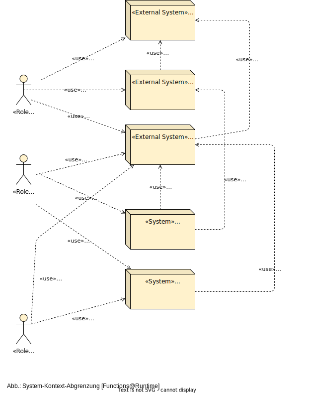
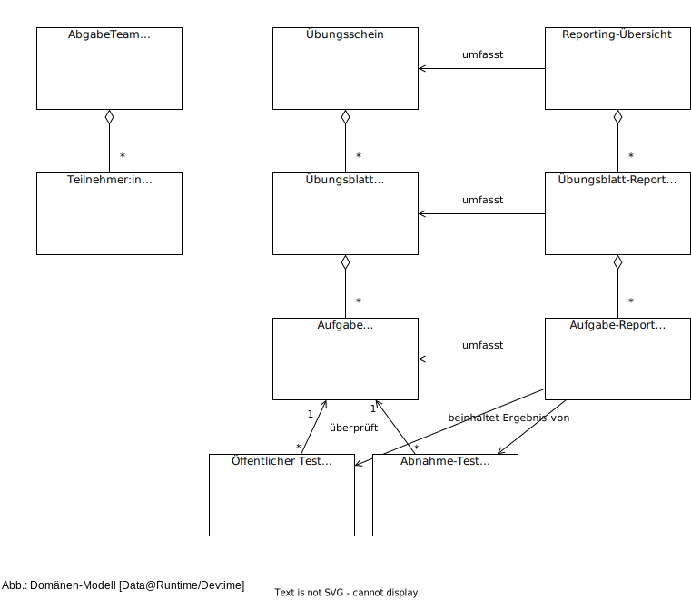
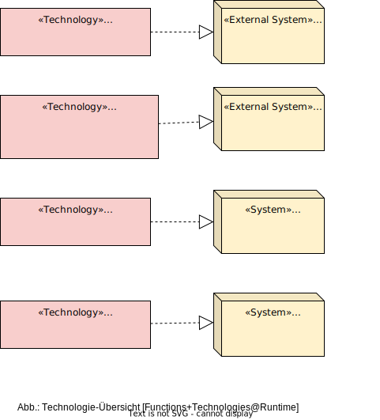

# Continuous Feedback For Exercises (CoFFE), Dokumentation <!-- omit in toc -->

Das CoFFE-Projekt zielt darauf ab, ein automatisiertes Feedback-System mit Reporting zu entwickeln, das Student:innen und Dozent:innen bei der Bearbeitung und Bewertung von Übungsaufgaben in Informatik-Lehrveranstaltungen unterstützt.

Dieses Dokument basiert auf **Version 2.0.0** der [ADF-Dokumentationsvorlage](https://github.com/architecture-decomposition-framework/adf-documentation-template). Es wurde im Rahmen des Projekts erstellt und verwendet, und kann außerdem als Beispiel für eine Dokumentation mit der ADF-Vorlage konsultiert werden.

## Inhalt <!-- omit in toc -->

- [1. Einleitung](#1-einleitung)
  - [1.1. Geschäftskontext](#11-geschäftskontext)
  - [1.2. Systemübersicht](#12-systemübersicht)
  - [1.3. Stakeholder](#13-stakeholder)
  - [1.4. Randbedingungen (Constraints)](#14-randbedingungen-constraints)
  - [1.5. Ziele des Dokuments](#15-ziele-des-dokuments)
- [2. Systemkontext und Domäne](#2-systemkontext-und-domäne)
  - [2.1. System-Kontext-Abgrenzung](#21-system-kontext-abgrenzung)
  - [2.2. Domänenmodell](#22-domänenmodell)
- [3. Architekturtreiber (Funktion und Qualität)](#3-architekturtreiber-funktion-und-qualität)
  - [3.1. Wesentliche funktionale Anforderungen](#31-wesentliche-funktionale-anforderungen)
    - [3.1.1. CoFFE-Create](#311-coffe-create)
      - [3.1.1.1. (C1) Automatisiertes Anlegen von GitLab-Projekten für jedes Abgabe-Team](#3111-c1-automatisiertes-anlegen-von-gitlab-projekten-für-jedes-abgabe-team)
      - [3.1.1.2. (C2) Automatisiertes Anlegen von GitLab-CI-Konfiguration](#3112-c2-automatisiertes-anlegen-von-gitlab-ci-konfiguration)
    - [3.1.2. Anforderungen an GitLab-Repos](#312-anforderungen-an-gitlab-repos)
      - [3.1.2.1. (G1) Team-Repo für Zusammenarbeit und Abgabe](#3121-g1-team-repo-für-zusammenarbeit-und-abgabe)
      - [3.1.2.2. (G2) Feedback zu den Übungsabgaben (lokal)](#3122-g2-feedback-zu-den-übungsabgaben-lokal)
      - [3.1.2.3. (G3) Erweitertes Feedback und Kontrolle der Übungsabgaben (auf dem GitLab-Server)](#3123-g3-erweitertes-feedback-und-kontrolle-der-übungsabgaben-auf-dem-gitlab-server)
      - [3.1.2.4. (G4) Aktualisierung der versteckten Tests](#3124-g4-aktualisierung-der-versteckten-tests)
    - [3.1.3. Anforderung an CoFFE-Reporting](#313-anforderung-an-coffe-reporting)
      - [3.1.3.1. (R1a) Reporting Übersicht](#3131-r1a-reporting-übersicht)
      - [3.1.3.2. (R1b) Excel-Export der Reporting Übersicht](#3132-r1b-excel-export-der-reporting-übersicht)
      - [3.1.3.3. (R2) Übungsblatt-Report](#3133-r2-übungsblatt-report)
      - [3.1.3.4. (R3) Aufgaben-Report](#3134-r3-aufgaben-report)
      - [3.1.3.5. (R4) Plagiatserkennung](#3135-r4-plagiatserkennung)
  - [3.2. Qualitätsattribute](#32-qualitätsattribute)
    - [3.2.1. Dokumentationsqualität (Nachvollziehbarkeit.1)](#321-dokumentationsqualität-nachvollziehbarkeit1)
    - [3.2.2. Fehlertoleranz bei Git-Repo-Erstellung (Fehlertoleranz.1)](#322-fehlertoleranz-bei-git-repo-erstellung-fehlertoleranz1)
    - [3.2.3. Dauer des Build-Prozesses eines Team-Repository (Performance.1)](#323-dauer-des-build-prozesses-eines-team-repository-performance1)
    - [3.2.4. Erkennen der Fehlerquelle beim Fehlschlagen des Builds (Nachvollziehbarkeit.2)](#324-erkennen-der-fehlerquelle-beim-fehlschlagen-des-builds-nachvollziehbarkeit2)
- [4. Systemdekomposition](#4-systemdekomposition)
  - [4.1. Lösungsansatz und zentrale Architekturentscheidungen](#41-lösungsansatz-und-zentrale-architekturentscheidungen)
  - [4.2. Systemstruktur](#42-systemstruktur)
  - [4.3. Deployment und Betrieb](#43-deployment-und-betrieb)
  - [4.4. Technologien](#44-technologien)
- [5. Lösungskonzepte](#5-lösungskonzepte)
  - [5.1. CoFFE-Create, Lösungskonzept](#51-coffe-create-lösungskonzept)
    - [5.1.1. Architektur-Treiber](#511-architektur-treiber)
    - [5.1.2. Lösungsidee und Design-Entscheidungen](#512-lösungsidee-und-design-entscheidungen)
    - [5.1.3. Anlegen der GitLab-Repos](#513-anlegen-der-gitlab-repos)
    - [5.1.4. Anlegen des initialen Team-Repository-Inhalts](#514-anlegen-des-initialen-team-repository-inhalts)
    - [5.1.5. weitere Schritte dokumentieren (TODO)](#515-weitere-schritte-dokumentieren-todo)
    - [5.1.6. Verworfene Alternativen](#516-verworfene-alternativen)
  - [5.2. Lösung-Überprüfungskonzept auf GitLab](#52-lösung-überprüfungskonzept-auf-gitlab)
    - [5.2.1. Architektur-Treiber](#521-architektur-treiber)
    - [5.2.2. Lösungsidee](#522-lösungsidee)
  - [5.3. Konzept Reporting](#53-konzept-reporting)
    - [5.3.1. Architektur-Treiber](#531-architektur-treiber)
    - [5.3.2. Lösungsidee](#532-lösungsidee)
    - [5.3.3. Design-Entscheidungen](#533-design-entscheidungen)
    - [5.3.4. Verworfene Alternativen](#534-verworfene-alternativen)
- [6. Risiken und technische Schulden](#6-risiken-und-technische-schulden)
- [7. Ausblick und Pläne für die Zukunft](#7-ausblick-und-pläne-für-die-zukunft)
- [8. Glossar](#8-glossar)
- [Copyright und Lizenz](#copyright-und-lizenz)

## 1. Einleitung

In diesem Dokument erfassen wir die Anforderungen an das im Projekt CoFFE zu entwickelnde System und machen und grundlegende Gedanken über Struktur, Prozesse und Terminologie.

### 1.1. Geschäftskontext

**Ziel** des CoFFE-Projekts ist es, Student:innen und Dozent:innen bei der Durchführung von **Übungsaufgaben** innerhalb von Informatik-bezogenen Lehrveranstaltungen besser zu unterstützen. Um dies zu erreichen, soll ein automatisiertes Feedback-System implementiert werden, welches es den Student:innen ermöglicht, kontinuierlich ihre Lösungen auf Korrektheit zu prüfen und ein **individuell zugeschnittenes Feedback** zu ihrem aktuellen Lösungsstand zu erhalten. Auch die Dozent:innen sollen durch das System unterstützt werden, indem es eine **schnelle Überprüfung der Abgaben** erleichtert, um so mehr Zeit für die Unterstützung der Student:innen in den Übungen zu haben.
Hierfür soll, aufbauend auf dem Feedback-System, ein entsprechendes **Reporting** erstellt werden.

### 1.2. Systemübersicht

Das Ergebnis des Projekts CoFFE ist eine Vorlage mit zugehöriger Anleitung, aus der sich dann Übungsaufgaben mit automatisiertem Feedback erstellen lassen.
Dieser Vorlage wird in den Übungen zu Mobile Roboter (AIN) und in den Übungen zu Software-Engineering 1 (WIN) getestet. Aus den Erfahrungen werden zwei einfache Beispiele in Python und Java extrahiert.
Dadurch soll eine **breite Anwendbarkeit** und die **Übertragbarkeit** in möglichst viele Lehrveranstaltungen verschiedenster Studiengänge der HTWG sichergestellt werden (es gibt z.B. 16 Veranstaltungen mit praktischer Übung an der HTWG, welche Programmierung im Titel tragen, verteilt über die Fakultäten IN, EI und MA und viele weitere mit Programmieranteilen).

### 1.3. Stakeholder

Unmittelbare Stakeholder:

- Projektleitung: Prof. Blaich und Prof. Schneider
- Projektmitarbeiter:innen
- Teilnehmer:innen der Veranstaltung Mobile Robotoer (AIN) und SWEN1 (WIN)
- Finanzierung: INdigit

Indirekte Stakeholder:

- Weitere Dozent:innen von Programmier-bezogener Lehrveranstaltungen
- Teilnehmer:innen dieser Veranstaltungen

### 1.4. Randbedingungen (Constraints)

Es ist eine **Projektlaufzeit** von 8 Monaten geplant, nämlich von **1.5.2023 bis 31.12.2023**, so dass erste Ergebnisse während des Sommersemesters direkt bei Veranstaltungen des Wintersemesters angewendet werden können.

Um einen **nachhaltige** Nutzung des Projektes sicherzustellen, wird bei der Implementierung darauf geachtet, nur HTWG-interne Serverdienste zu verwenden, die auf bestehenden Servern ohne weitere Lizenzkosten laufen.
Dadurch kann die im Rahmen des Projektes aufgebaute Infrastruktur zukünftig ohne zusätzliche Kosten weiterbetrieben werden.

Konkret soll die Vorlage mit dem HTWG-Moodle-Server und den beiden GitLab-Servern der Fakultät Informatik funktionieren.

### 1.5. Ziele des Dokuments

Dieses Dokument soll das Projekt dokumentieren und technische Beschreibungen liefern, um *Continous Feedback* für Übunsaufgaben aufzusetzen.

Zielgruppe der Dokumentation sind Dozent:innen von Programmier-bezogenen Vorlesungen mit Grundkenntnissen von Git und GitLab.

Die Dokumentation wird kontinuierlich weiterentwickelt.

## 2. Systemkontext und Domäne

Wir beschreiben in diesem Kapitel, in welchem Kontext das Feedback-System eingesetzt wird.

### 2.1. System-Kontext-Abgrenzung

<!-- 
- Wie ist das System in seinen Kontext eingebettet?
- Von welchen Rollen wird das System aus welchem Grund verwendet?
- Welche Nutzerschnittstellen bietet das System?
- Mit welchen externen Systemen interagiert das System?
- (Wie ist das System in seine Systemlandschaft integriert?)
- Auf welche Weise interagiert das System mit externen Systemen und welche Daten werden ausgetauscht?
-->

Rollen:

- Teilnehmer:in: Nimmt an der Übung teil. Erledigt Programmieraufgaben.
- Dozent:in: Leitet den Kurs. Vergibt Übungsschein
- Tutor:in: Unterstützt im Kurs. Nimmt Übungsaufgaben an.

Systeme:

- RZ-SSO: Single-Sign-On des HTWG-Rechenzentrums, zentrale Authentifizierung für alle Hochschulangehörigen
- Moodle: Moodle-Server. Hier gibt es einen Kurs zu der Lehrveranstaltung. Hier können sich Teilnehmer:innen in Abgabe-Teams eintragen
- GitLab: Git-Server mit Team-Repositories und weitere Konfiguration zum automatischen Ausführen von Tests
- CoFFE-Create: Skript(e) zum Anlegen der Team-Projekte anhand der Daten aus Moodle
- CoFFE-Reporting: Graphische Übersicht mit dem Fortschritt über die einzelnen Übungsaufgaben

### 2.2. Domänenmodell

<!-- 
- Welche Entitäten (Kernelemente aus der geschäftlichen Domäne) gibt es, die im System eine Bedeutung haben und davon verarbeitet werden müssen?
- Wie ist die jeweilige Bedeutung der unterschiedlichen Entitäten?
- Wie hängen die Entitäten miteinander zusammen?
- (Lassen sich Unterdomänen bilden, in denen die Entitäten jeweils eine unterschiedliche Bedeutung haben?)
-->

Die Kernelemente im System sind die folgenden:

- Ein Abgabe-Team, besteht aus mehreren
  - Teilnehmer:innen
- Ein Übungsschein, wird erreicht bei erfolgreicher Bearbeitung von mehreren
- Übungsblättern (wöchentlich), besteht aus mehreren
  - Übungsaufgaben, werden getestet durch
    - Öffentliche Tests
      - Das sind Tests, die in den Repositories der Abgabe-Teams vorhanden und für alle sichtbar sind
      - Diese Test können durch die Dozent:innen vorgegeben sein oder von den Teilnehmer:innen selbst geschrieben werden (oder beides).
    - Abnahme-Tests
      - Das sind Tests, deren Inhalt für die Teilnehmer:innen verborgen ist.
      - Die Ergebnisse dieser Tests werden für die Bewertung der Abgabe herangezogen.
- Reporting
  - pro Test, akkumuliert zu
  - pro Aufgabe, akkumuliert zu
  - pro Übungsblatt, akkumuliert zu
  - pro Veranstaltung

Wir verwenden folgende englische Begriffe:

| Deutsch | Englisch |
| ------- | ------- |
| Dozent:in | Lecturer |
| Tutor:in | Tutor |
| (Lehr-)Veranstaltung | Course |
| Abgabe-Team | (submission) team |
| Teilnehmer:in | participant
| Übungsschein | (course) certificate |
| Übungsblatt | exercise (sheet) |
| Aufgabe | task |
| öffentliche Tests | public tests |
| Abnahme-Tests | submission tests |
| Reporting-Übersicht | reporting overview |
| Übungsblatt-Report | exercise report |
| Aufgabe-Report | task report |

## 3. Architekturtreiber (Funktion und Qualität)

In den folgenden Kapiteln wird ein Überblick über die wichtigsten Anforderungen für das System gegeben, welche die Ausgestaltung der Architektur beeinflussen. Diese Anforderungen, genannt Architekturtreiber, umfassen  funktionale Anforderungen und Qualitätsanforderungen (in diesem Kapitel beschrieben) sowie Geschäftsziele und Randbedingungen (bereits in Kapitel 1 beschrieben).

### 3.1. Wesentliche funktionale Anforderungen

Wir beschreiben diese als User-Stories mit Akzeptanz-Kriterien.

#### 3.1.1. CoFFE-Create

##### 3.1.1.1. (C1) Automatisiertes Anlegen von GitLab-Projekten für jedes Abgabe-Team

Als Dozent:in kann ich *(teil-)automatisiert* (vgl. [Glossar](#8-glossar)) aus Moodle die Abgabe-Teams abrufen (Name des Teams und Mitglieder, s. [Domänen-Modell](#22-domänenmodell)) und für jedes Team ein entsprechendes GitLab-Repository innerhalb einer festgelegten GitLab-Gruppe anlegen, damit ich diesen Schritt nicht umständlich und fehleranfällig zig-mal manuell durchführen muss.

Akzeptanz-Kriterien:

- GitLab-Repository mit Team-Name ist angelegt
- GitLab-Repository ist mit initialem Projekt gefüllt
  - in dem individuellen Team-Projekt kann an einzelnen Stellen der Team-Name eingesetzt werden, z.als Maven-Artifact-Id in der pom.xml oder als name in der package.json.
  - in den Projekten kann eine .gitlab-ci.yml hinterlegt werden, welche den automatischen Build konfiguriert
- Team-Mitglieder haben Commit-Rechte auf dem Repository
  - die Rechte können initial konfiguriert werden (Owner oder Developer)
- Ablaufdatum (optional) ist gesetzt
- Dozent:in und Tutor:innen haben Maintainer-Rechte auf den Repos

##### 3.1.1.2. (C2) Automatisiertes Anlegen von GitLab-CI-Konfiguration

Als Dozent:in kann ich die GitLab-CI-Konfiguration an zentraler Stelle vornehmen und jederzeit Änderungen an alle Team-Repositories verteilen, um Zeit zu sparen und Konfiguration flexibel während des Übungsbetriebs anpassen zu können (gerade bei der ersten Durchführung der Übung mit CoFFE-Unterstützung sind noch einige Anpassungen zu erwarten).

Akzeptanz-Kriterien:

- Die GitLab-CI-Konfiguration kann zentral an einer Stelle vorgenommen werden - diese umfasst
  - die CI-Pipeline zur Ausführung der Unit-Tests in den Team-Projekten selbst
  - Abnahme-Tests, siehe [Glossar](#8-glossar)
  - CI-Pipeline zur Ausführung der Abnahme-Tests
  - Erfassung und Archivierung der Test-Ergebnisse (für späteres Reporting)
- Die Konfiguration und Änderungen an dieser werden automatisch an alle Team-Repos verteilt.

#### 3.1.2. Anforderungen an GitLab-Repos

##### 3.1.2.1. (G1) Team-Repo für Zusammenarbeit und Abgabe

Als Teilnehmer:in erhalte ich ein Git-Repository für meine Übungsabgabe, damit ich darüber mit meinem Team-Partner zusammenarbeiten kann und bis zu der vom Dozenten:in vorgegebenen Deadline mein Übungsblatt abgeben kann.

Akzeptanz-Kriterien:

- Das Repository enthält ein fertig konfiguriertes Projekt, welches man mit der verwendeten Entwicklungsumgebung öffnen kann.
- Für alle Team-Mitglieder sind Rechte gesetzt
  - zum Zugriff/Auschecken
  - zum Committen (je nach Veranstaltung darf nur auf Feature-Branches oder aber auch auf main committet werden)

##### 3.1.2.2. (G2) Feedback zu den Übungsabgaben (lokal)

Als Teilnehmer:in kann ich lokal auf meinem Rechner automatisierte Tests ausführen, um Rückmeldung zu erhalten, welche Übungsaufgaben ich korrekt bearbeitet habe und bei welchen Übungsaufgaben es noch Probleme gibt.

Akzeptanz-Kriterien:

- Die Tests lassen sich über die Kommandozeile oder die Test-Funktion der Entwicklungsumgebung ausführen.
- Die Konfiguration dafür ist bereits im Team-Repo enthalten.

##### 3.1.2.3. (G3) Erweitertes Feedback und Kontrolle der Übungsabgaben (auf dem GitLab-Server)

Als Teilnehmer:in erhalte nach jedem Commit durch automatisierte Tests auf dem GitLab-Server auch dann Feedback, wenn ich vergessen habe, lokal die Tests auszuführen.

Als Dozent:in kann ich durch automatisierte Tests die Korrektheit der Abgaben überprüfen und kann dabei auch Tests ausführen, welche die Teilnehmer:innen nicht kennen, um zu verhindern, dass die Teilnehmer:innen Ihre Abgaben gezielt auf die bekannten Tests zuschneiden. Diese Tests werden **Abnahme-Tests** genannt.

Akzeptanz-Kriterien:

- Als Benachrichtigung ist eine E-Mail oder eine Chat-Nachricht möglich.
- Diejenige Person, welche Änderungen committet hat, erhält nach erfolgreichem Durchlaufen des Builds eine Benachrichtigung über den Erfolg.
- Alle Teammitglieder erhalten Rückmeldungen,
  - wenn der Code nicht compiliert,
  - (optional) wenn der Code nicht richtig formatiert ist oder nicht den Style-Guidelines entspricht,
  - wenn öffentliche Tests aus dem Team-Repository fehlschlagen,
  - wenn Abnahme-Tests fehlschlagen (ohne jedoch den genauen Inhalt der Tests sehen zu können).
- Das Nicht-Kompilieren bzw. Fehlschlagen der Tests eines Team-Projekts darf den Build anderer Projekte nicht beeinträchtigen.
- Es wird verhindert, dass Teilnehmer:innen die Tests modifizieren, z.B. indem sichergestellt wird, dass die nicht-versteckten Tests auf jeden Fall in der ursprünglich geplanten Form ausgeführt werden.

##### 3.1.2.4. (G4) Aktualisierung der versteckten Tests

Als Dozent:in kann ich jederzeit während der Durchführung der Lehrveranstaltung die versteckten Tests anpassen, damit ich Fehler in den Tests beseitigen kann und weitere Tests hinzufügen kann, welche den Teilnehmer:innen besseres Feedback liefern.

Akzeptanz-Kriterien:

- Die versteckten Tests werden zentral an einer Stelle verwaltet und automatisch beim CI-Build der Team-Repos miteingebunden.

#### 3.1.3. Anforderung an CoFFE-Reporting

##### 3.1.3.1. (R1a) Reporting Übersicht

Als Dozent:in kann ich auf einer Übersichtsseite für alle Abgabe-Teams einer Veranstaltung sehen, wie viele Tests pro Übungsblatt erfolgreich durchgelaufen sind.
Es wird dabei nach öffentlichen und Abnahme-Tests unterschieden.

Akzeptanz-Kriterien:

- Übersichtsseite ist angelegt und über GitLab zugänglich
- Die Anzahl erfolgreicher Tests ist für alle Übungsblätter aller Abgabe-Teams auf einer Seite einsehbar
- Die erfolgreichen Tests werden dabei sowohl absolut als auch in Prozent angeben
- nur Dozent:in und Tutor:innen können die Übersicht einsehen

##### 3.1.3.2. (R1b) Excel-Export der Reporting Übersicht

Als Dozent:in möchte ich im CoFFE-Dashboard einen Excel Export der gesamten Übungsveranstaltung machen können, damit ich die Daten auch außerhalb der Website verfügbar habe (auch ohne Internet), sie sichern und weiterverarbeiten kann.

Akzeptanzkriterien:

- Excel-Export umfasst die gesamte Übungsveranstaltung
- unbedingt erforderliche Daten sind: (1) Teams (2) mit Abgaben (3a) mit öffentlichen Tests (3b) mit Abnahme-Tests und (3c) eventuellen Kompilierungsfehlern
- die Erstellung dieser Excel-Datei soll performant und ressourcenschonend erfolgen (nur dann, wenn sich die Daten geändert haben, nicht jedes Mal im Client)
- der Excel Export soll mit einem Klick gedownloadet werden können

##### 3.1.3.3. (R2) Übungsblatt-Report

Als Teilnehmer:in kann ich auf einer Übersichtsseite sehen, wie viele Tests meiner abgegebenen Lösungen pro Übungsblatt erfolgreich durchgelaufen sind.
Es wird dabei nach öffentlichen und nicht-öffentlichen Tests unterschieden.

Akzeptanz-Kriterien:

- Die Übersichtsseiten sind angelegt und über GitLab zugänglich
- Die Anzahl erfolgreicher Tests aller Übungsblätter eines Abgabe-Teams sind auf einer Seite einsehbar
- Die erfolgreichen Tests werden dabei sowohl absolut als auch in Prozent angeben
- Dozent:in, Tutor:innen können alle Übungsblatt-Reports einsehen
- Teilnehmer:in können nur den zu ihrem  Abgabe-Team gehörenden Übungsblatt-Report einsehen

##### 3.1.3.4. (R3) Aufgaben-Report

Als Teilnehmer:in kann kann ich auf einer Übersichtsseite sehen, wie viele Tests meiner abgegebenen Lösungen zu einer Aufgabe erfolgreich durchgelaufen sind.
Es wird dabei nach öffentlichen und nicht-öffentlichen Tests unterschieden.

Akzeptanz-Kriterien:

- Aufgaben-Report ist angelegt und über GitLab zugänglich
- Für jede Aufgabe gibt es eine Übersicht die zeigt welche Tests erfolgreich und welche noch nicht erfolgreich sind
- Dozent:in, Tutor:innen können alle Aufgaben-Reports einsehen
- Teilnehmer:in können nur den zu ihrem  Abgabe-Team gehörenden Aufgaben-Report einsehen

##### 3.1.3.5. (R4) Plagiatserkennung

Als Dozent:in möchte ich gerne überprüfen können, ob Teilnehmer:innen die Bearbeitung selbstständig erstellt haben, um ggf. eine Verwarnung auszusprechen.

Akzeptanz-Kriterien:

- Duplikate zu anderen Team-Repositories werden erkannt
- (optional) die Verwendung von ChatGPT wird erkannt
- verdächtige Code-Abschnitte werden im Reporting markiert (optimalerweise zusammen mit einem Wahrscheinlichkeitswert für Duplikat/Plagiat)

### 3.2. Qualitätsattribute

Die Qualitätsattribute des System werden in den folgenden Unterkapiteln in Form von Architektur-Szenarios beschrieben, um sie messbar bzw. testbar zu haben.

<!-- Vorlage für Qualitätsszenarios: 

#### 3.2.1. Szenario-Name (Szenario-ID)

- Priorität: Hoch (Hoch, Mittel, Niedrig)
- Status: Offen (Offen, Bereit, Umgesetzt). _Eventuell sind weitere Möglichkeiten sinnvoll. Die Menge der Zustände sollte am Anfang des Projekts definiert werden._
- Umgebung: _Kontext und/oder Ausgangssituation, die auf dieses Szenario zutrifft_
  - _ggf. Quantifizierung, Messbare Effekte, die die Umgebung betreffen_
- Stimulus: _Das Ereignis, der Auslöser oder die Bedingung, die sich in diesem Szenario ergeben_
  - _ggf. Quantifizierung, also messbare Effekte, die den Stimulus (Auslöser) betreffen_
- Antwort: _Die erwartete Reaktion des Systems auf das Szenario-Ereignis (Black-Box-Ansicht, die keine Einschränkungen für das Design vorsieht)_
  - _ggf. Quantifizierung, also messbare Effekte, die auf die Reaktion treffen und/oder messbare Indikatoren, dass das Szenario durch die Architektur umgesetzt wurde_

-->

#### 3.2.1. Dokumentationsqualität (Nachvollziehbarkeit.1)

- Priorität: Hoch (Hoch, Mittel, Niedrig)
- Status: Offen (Offen, Bereit, Umgesetzt).
- Umgebung: Dozent:in D möchte CoFFe-System/Skripte einsetzen.
  - D hat keine Vorkenntnisse mit CoFFe, aber bereits Erfahrung mit Git und GitLab oder GitHub
- Stimulus: Dozent:in liest die Dokumentation und sieht sich ein Beispiel-Projekt (Java oder Python) an
  - 30 min Lesezeit
- Antwort: Dozent:in hat ein gutes Verständnis, wie CoFFe funktioniert  und kann innerhalb kurzer Zeit einen Plan aufstellen, wie CoFFe für die eigene Veranstaltung angewendet werden kann.
  - Dozent:in kennt die verschiedenen Bestandteile von CoFFe
  - Dozent:in weiß, welche Daten zwischen welchen Systemen ausgetauscht werden
  - Planerstellung innerhalb von 30 min

#### 3.2.2. Fehlertoleranz bei Git-Repo-Erstellung (Fehlertoleranz.1)

- Priorität: Hoch (Hoch, Mittel, Niedrig)
- Status: Offen (Offen, Bereit, Umgesetzt)
- Umgebung: Die Teams und Teammitglieder sind bekannt.
  - 20 Teams, 2-3 Mitglieder pro Team
- Stimulus: Die Repositories werden in GitLab angelegt und mit entsprechenden Rechten versehen. Bei dieser Operation gibt es einen Fehler, z.B.
  - Netzwerkverbindung bricht ab
  - User ist in GitLab nicht vorhanden
- Antwort: Der Prozess registriert diesen Fehler. Man kann zu späterem Zeitpunkt den Prozess erneut anstoßen, um die fehlenden Operationen zu wiederholen
  - beliebig oft Wiederholung möglich, bis alle Operationen abgeschlossen sind

#### 3.2.3. Dauer des Build-Prozesses eines Team-Repository (Performance.1)

- Priorität: Mittel (Hoch, Mittel, Niedrig)
- Status: Offen (Offen, Bereit, Umgesetzt)
- Umgebung: Ein Team arbeitet an einem normalen Programmierprojekt. Ein Team-Mitglied hat Änderungem am Code vorgenommen, welche den Code compilieren lassen und mit allen Tests kompatibel sind (auch mit den versteckten).
  - Projekt mit Java- oder Python-Code und gewöhnlichen Unit-Tests (ohne aufwändige Simulationsumgebung)
- Stimulus: Die Änderungen werden committet und auf den GitLab-Server gepusht.
- Antwort: Der Buildprozess läuft durch und der Committer erhält in vertretbarer Zeit eine Erfolgsbenachrichtigung.
  - Zeit von Push bis Benachchrichtugung <= 3 Minuten

#### 3.2.4. Erkennen der Fehlerquelle beim Fehlschlagen des Builds (Nachvollziehbarkeit.2)

- Priorität: Hoch (Hoch, Mittel, Niedrig)
- Status: Offen (Offen, Bereit, Umgesetzt)
- Umgebung: Ein Team arbeitet an einem normalen Programmierprojekt.
- Stimulus: Ein Team-Mitglied nimmt Änderungem am Code vor, welche einen Fehler beinhalten, committet pusht diese auf den GitLab-Server.
- Antwort: Der Buildprozess schlägt fehl, alle Team-Mitglieder werden benachrichtigt und sind in der Lage, mit wenigen Klicks herauszufinden, was genau die Fehlerursache ist.
  - maximal 3 Klicks
  - genaue Fehlerursache ist ersichtlich:
    - Compilierfehler in welcher Klasse/Zeile, oder
    - Liste aller Tests, die fehlgeschlagen sind, zusammen mit der Information, ob es sich um öffentliche oder Abnahme-Tests handelt.

## 4. Systemdekomposition

In den Unterabschnitten dieses Kapitels beschreiben wir, wie die grundlegende Lösungsstrategie für das System ist, welche wichtigen Entscheidungen für das System getroffen wurden, wie das System nach Funktionalität, Daten und Deployment gegliedert ist und warum die Gliederung entsprechend gewählt wurde.

### 4.1. Lösungsansatz und zentrale Architekturentscheidungen

Der grundsätzliche Lösungsansatz besteht darin, möglichst viel vorhandene Funktionalität zu verwenden:

- Gruppeneinteilung in Moodle,
- GitLab-Build/-Pipeline für die Darstellung der Test-Ergebnisse für die Teilnehmer:innen,
- GitLab-CI für das Abarbeiten bestimmter Aufgaben,
- GitLab-Pages als Möglichkeit, Reporting-Ergebnisse darzustellen.

Die Eigenentwicklung beschränkt sich im Wesentlichen auf

- die Skripte zum Anlegen der Team-Repositories (CoFFE-Create),
- diverse CI-Pipelines (unterschiedlich je nach verwendeter Programmiersprache),
- die Übersicht über alle Übungsblätter-Abgaben (CoFFE-Reporting).

### 4.2. Systemstruktur

Die Grundlegende Struktur der Systeme und der verschiedenen Benutzerrollen wird bereits in [2.1. System-Kontext-Abgrenzung](#21-system-kontext-abgrenzung) gezeigt.

Im folgenden wollen wir darstellen, wie der GitLab-Server die einzelne Funktionalität umsetzt. Wir sehen uns dazu die GitLab-Projekt-Struktur genauer an:

Der genaue Inhalt von **submission-pipeline** und **submission-tests** variiert je verwendeter Programmiersprache und ist in der spezifischen Dokumentation des Projekts genauer erklärt.

### 4.3. Deployment und Betrieb

Nach dem initialen Anlegen der Projekte über CoFFE-Create laufen die einzelnen Verarbeitungsschritte alle innerhalb von GitLab bzw. den konfigurierten GitLab-Runnern ab, welche die einzelnen GitLab-CI-Pipelines ausführen.

### 4.4. Technologien

Die verwendeten Technologien sind in folgendem Bild zusammengefasst.

## 5. Lösungskonzepte

In diesem Kapitel beschreiben wir, wie Sie die von den Architekturtreibern geforderten Funktions- und Qualitätsziele erreichen.

### 5.1. CoFFE-Create, Lösungskonzept

Mit CoFFE-Create soll die Repository-Struktur (teil-)automatisiert angelegt werden.

#### 5.1.1. Architektur-Treiber

- [3.1.1.1. (C1) Automatisiertes Anlegen von GitLab-Projekten für jedes Abgabe-Team](#3111-c1-automatisiertes-anlegen-von-gitlab-projekten-für-jedes-abgabe-team)
- [3.1.1.2. (C2) Automatisiertes Anlegen von GitLab-CI-Konfiguration](#3112-c2-automatisiertes-anlegen-von-gitlab-ci-konfiguration)

#### 5.1.2. Lösungsidee und Design-Entscheidungen

Wir verwenden verschiedene Skripte, um die einzelnen Aufgaben zu erledigen.

Design-Entscheidungen:

- Die Skripte sollen lokal auf dem Dozenten:in-Rechner ausgeführt werden.

#### 5.1.3. Anlegen der GitLab-Repos

- ein Personal Access Token wird [automatisch](https://docs.gitlab.com/ee/user/profile/personal_access_tokens.html#create-a-personal-access-token-programmatically) beim CoFFE-Create für den:die Dozent:in erstellt
  - Ablaufdatum konfigurierbar ([default und max.: 365 Tage gültig](https://docs.gitlab.com/ee/user/profile/personal_access_tokens.html#create-a-personal-access-token))
- Dozent:in wählt Name eine GitLab-Gruppe
- Gruppe wird an einem gegebenen Ort mit gegebenem Namen automatisch erstellt, mit folgender Konfiguration:
  - Owner (Rolle): Account des Dozenten
  - Visbility: Private
  - CI/CD Variable: Personal Access Token des:r Dozent:in (siehe erster Punkt))

#### 5.1.4. Anlegen des initialen Team-Repository-Inhalts

Idee: Die Dozent:innen können automatisch die Repositories mit Grundgerüst und erforderlicher Konfiguration füllen lassen, damit diese ohne viel manuellen Aufwand sofort bereit zur Nutzung sind.

- Konfiguration des Repositorys:
  <!-- - [NO ACTION REQUIRED] Owner (Rolle): Account des Dozenten | Dem Dozenten wird die Owner Rolle auf dieses Repository durch die Gruppe vererbt -->
  - Ort: in der designiterten Gruppe ([siehe 5.1.3. Anlegen der GitLab-Repos](#513-anlegen-der-gitlab-repos))
  - Developer: Student:innen Accounts (mehrere)
  - Developer: Tutor:innen Accounts (mehrere)
  - Visibility: Private
- Inhalt
  - eine CI/CD Pipeline Datei (`.gitlab-ci.yml`), die auf die CI/CD Pipeline Datei für Studenten im Teacher's Repo verweist (siehe [5.2.2. Lösungsidee](#522-lösungsidee))
  - (optional) vom Dozenten vorgegebenes Projekt-Grundgerüst / Vorlage (Order und Dateien)

#### 5.1.5. weitere Schritte dokumentieren (TODO)

#### 5.1.6. Verworfene Alternativen

- Man könnte vieles auch als WebApp umsetzen.
  - Vorteile:
    - Nutzerfreundlicher
  - Nachteile:
    - Viel größerer Aufwand
    - Kein einfacher Zugriff auf lokale Dateien und lokale Git-Installation
  - Ausblick: Durch die Verwendung von Node.js für die CoFFE-Create-Skripte würde ein einfachere Umstellung in Richtung WebApp möglich sein.

### 5.2. Lösung-Überprüfungskonzept auf GitLab

Wir müssen einerseits die Abnahme-Tests und andererseits die GitLab-CI-Konfiguration irgendwo hinterlegen, wo sie von GitLab auffindbar sind.

#### 5.2.1. Architektur-Treiber

- [G3](#3123-g3-erweitertes-feedback-und-kontrolle-der-übungsabgaben-auf-dem-gitlab-server)

#### 5.2.2. Lösungsidee

Wir verwenden ein Dozent:innen-Repo, ein zentrales Laborpraktikumsprojekt mit versteckten Tests und den CI/CD Pipelines des Systems

- Konfiguration des Repositorys:
  - Owner (Rolle): Account des Dozenten
  - Visibility: Private
- Inhalt
  - ein vollständiges Labor-Projekt (`src` Ordner und mehr)
  - eine vollständige Lösungs-Test-Suite (`test` Ordner)
  - eine CI/CD Pipeline (`.gitlab-ci.yml` Datei), die den `test` Ordner als komprimierte Archiv-Datei verpackt und als Job Artefakt ablegt.
  - eine CI/CD Pipeline (`.students-gitlab-ci.yml` Datei), die die Archiv-Datei mit den Lösungs-Tests holt und dann alle Tests im Repository ausführt und Ergebnisse als Job-Artefakt ablegt (bestimmt für die Verwendung im Team-Repository der Teilnehmer:innen)

### 5.3. Konzept Reporting

Mit CoFFE-Report soll der Bearbeitungsstand (Anzahl erfolgreicher Tests) zu den einzelnen Übungsblättern und den Aufgaben übersichtlich dargestellt werden.
Ein Report für Dozent:in und Tutor:innen soll eine Übersicht über den Bearbeitungsstand aller Abgabe-Teams einer Veranstaltung übersichtlich darstellen.

#### 5.3.1. Architektur-Treiber

Die Treiber für das Reporting sind R1, R2, R3 und R4.

#### 5.3.2. Lösungsidee

Realisierung der Reporting Seiten über gitlab pages.

Für das Veranstaltungsreporting wird ein eigenes Repository angelegt in dem die Testergebnisse aller Übungsblätter aller Abgabe-Teams gesammelt werden.

- Die CI-Pipeline pushed die Testergebnisse in das Reporting Repository oder,
- es wird ein Skript verwendet um die Testergebnisse aller Abgabe-Teams einzusammeln

#### 5.3.3. Design-Entscheidungen

#### 5.3.4. Verworfene Alternativen

Gitlab eigene Dashboards für die Übersicht verwenden.
Dieser Ansatz wurde verworfen, da die Funktionalität nur in der kostenpflichtigen Premiumversion von gitlab zur Verfügung steht.

- <https://docs.gitlab.com/ee/ci/environments/environments_dashboard.html>
- <https://gitlab.com/gitlab-org/gitlab/-/issues/7861>
- <https://gitlab.com/gitlab-org/gitlab/uploads/15e5d7b458b3a20f476f07044bef4497/dashboard.png>

<!--

### 5.4. Konzept-Vorlage

Wir benutzten als Überschrift den konkreten Namen des Lösungskonzepts, z.B. "Mandantenkonzept", "Skalierbarkeit", "Logging", "Testbarkeit", "Internationalisierung", "Monitoring", "Konfiguration", "Offline-Fähigkeit und Datensynchronisation".

#### 5.4.1. Architektur-Treiber

- Welche Treiber werden von diesem Konzept angesprochen/umgesetzt?

Es genügt, wenn wir Referenzen auf die Treiber einfügen (z.B. die Scenario-ID).

#### 5.4.2. Lösungsidee

- Welche Idee verfolgen wir mit diesem Konzept?

Wir illustrieren die Idee mit Architektur-Sichten und entsprechendem Begleittext.

#### 5.4.3. Design-Entscheidungen

- Welche grundsätzlichen Design-Entscheidungen haben wir für dieses Lösungskonzept getroffen? Z.B. Architekturstil(e), Technologien, Frameworks, Strategien

#### 5.4.4. Verworfene Alternativen

- Welche alternative(n) Lösung(en) haben wir diskutiert und verworfen?
- Warum wurden sie verworfen?

-->

## 6. Risiken und technische Schulden

Es gibt in den verschiedenen Teilen des Systems viele verschiedene Technologien. So ist CoFFE-Create in Java geschrieben (weil es auf schon vorhandenen Skripten basiert, für die es ein großer Aufwand gewesen wäre, sie neu zu schreiben). Die Pipeline-Skripte verwenden Linux-Shell-Befehle, rufen teilweise Python-Skripte auf und bei der Web-Seite für das Reporting handelt es sich um JavaScript und HTML. Diese Vielfalt macht es nicht unbedingt leicht, alle Teile zu überblicken.

## 7. Ausblick und Pläne für die Zukunft

Im Großen und Ganzen wurden alle Anforderungen umgesetzt. Erweiterte Überprüfungen wie Plagiat-Checks wurden noch nicht eingebaut.

Im Java-Umfeld zeigt sich, dass es nicht so einfach ist, die CI-Ergebnisse für die Teilnehmer:innen nachvollziehbar darzustellen. Die Pipeline-Konsole-Ausgaben sind hier nicht immer hilfreich - vor allem bei weniger erfahrenen Programmierer:innen. Außerdem gibt es in Java keine einfache Möglichkeit, Tests auszuführen, wenn es Compile-Fehler im Code gibt. Bei Compilefehlern werden gar keine Tests ausgeführt. Das ist bei Programmiersprachen wie Python, die nicht kompiliert werden müssen, einfacher: Hier können auch Tests ausgeführt werden, wenn Teile des Codes fehlerhaft sind.

Bei der Recherche im Rahmen von CoFFE wurden wir zudem auf das Projekt Artemis der TUM aufmerksam (<https://docs.artemis.cit.tum.de/index.html>). Artemis wird bereits von verschiedenen Hochschulen eingesetzt, erfüllt viele der Anforderungen an CoFFE und ist daher ein vielversprechender Kandidat als Alternative zu CoFFE. Wir empfehlen daher, Artemis auszuprobieren, bevor CoFFE umfangreich weiterentwickelt wird.

## 8. Glossar

*automatisiert*: Mit diesem Begriff meinen wir einen Prozess, der basierend auf Benutzereingaben oder einer initialen Konfiguration eine große Anzahl von Schritten komplett ohne Eingreifen durchführt.

*teil-automatisiert*: vergleiche *automatisiert*, jedoch ist hier zwischenzeitliches Eingreifen möglich, z.B. um Zwischenergebnisse zu überprüfen und zu ergänzen, oder um ein automatisch generiertes Skript an anderer Stelle auszuführen.

*Abnahme-Tests*: Unit-Tests, die den Code der Teilnehmer:innen testen, jedoch für die Teilnehmer:innen nicht einsehbar sind, siehe auch [2.2. Domänenmodell](#22-domänenmodell).

## Copyright und Lizenz

Copyright 2023-2025 Prof. Dr. Johannes C. Schneider. Alle Rechte liegen beim Urheber. Bei Interesse an der Verwendung/Verbreitung dieser Dokumentation, welche über die Verlinkung zu diesem Repository hinausgeht, bitte [Kontakt mit J. Schneider](https://www.htwg-konstanz.de/hochschule/fakultaeten/informatik/orga/professoren/schneider) aufnehmen.
